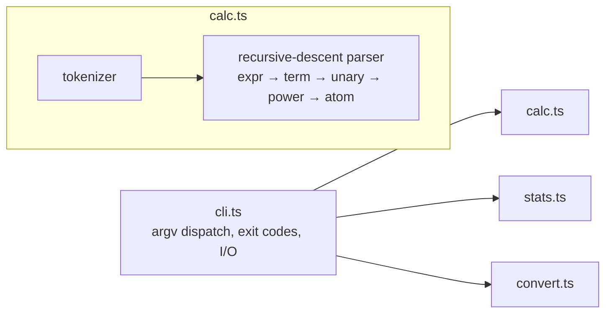

# devkit

A zero-dependency TypeScript command-line toolkit: an expression calculator with a
hand-written parser, streaming text statistics, and unit conversion. Built to
demonstrate CLI fundamentals — safe parsing, predictable Unix behavior, streaming
I/O, and machine-readable output — without hiding anything behind packages.

**Zero runtime dependencies.** The only dev dependencies are TypeScript, Prettier,
and Node type definitions. Expressions are parsed by a real tokenizer and
recursive-descent parser; `eval`, `Function`, and shell execution are never used.

## Install

Requires Node.js 22 or later.

```sh
git clone https://github.com/jordan-umpierre/devkit.git
cd devkit
npm ci
npm run build
npm install -g .
```

Or install the tarball attached to a [GitHub release](https://github.com/jordan-umpierre/devkit/releases):

```sh
npm install -g ./devkit-1.0.0.tgz
```

## Usage

```sh
$ devkit calc "(2 + 3) * 4 ^ 0.5"
10

$ devkit calc "2^-2" --json
{"expression":"2^-2","result":0.25}

$ devkit stats LICENSE
bytes: 1072
lines: 21
words: 169
chars: 1072
top words:
  1. the (14)
  2. or (9)
  3. software (9)
  4. of (8)
  5. to (8)

$ echo "hello hello world" | devkit stats - --json
{"bytes":18,"lines":1,"words":3,"chars":18,"topWords":[{"word":"hello","count":2},{"word":"world","count":1}]}

$ devkit convert 100 c f
212

$ devkit convert 5 km mi --json
{"value":5,"from":"km","to":"mi","result":3.1068559611866697}
```

`devkit --help` documents everything below in the terminal.

### calc

Evaluates arithmetic expressions with decimals, parentheses, unary signs, and
`+ - * / % ^`. Precedence from loosest to tightest: `+ -`, then `* / %`, then
unary sign, then `^` (right-associative, so `2^3^2 = 512` and `-2^2 = -4`).
Malformed expressions, trailing tokens, division or modulo by zero, and
non-finite results (overflow, `NaN`) are rejected with exit code 1.

### stats

Reports on a file or stdin (`-`): total **bytes**, **lines** (newline count),
**words** (whitespace-separated, `wc`-style), **chars** (Unicode code points),
and the five most frequent normalized words (lowercased runs of letters/digits,
ties broken alphabetically so output is deterministic). Input is streamed chunk
by chunk — arbitrarily large files are fine, and multi-byte UTF-8 sequences
split across chunk boundaries are decoded correctly.

### convert

Converts between units of the same dimension (case-insensitive):

| Dimension   | Units                                  |
| ----------- | -------------------------------------- |
| length      | `mm` `cm` `m` `km` `in` `ft` `yd` `mi` |
| mass        | `mg` `g` `kg` `oz` `lb`                |
| temperature | `c` `f` `k`                            |

Length and mass use exact factors to a base unit; temperature uses explicit
affine formulas through Kelvin, since temperature scales don't share a zero.

## Exit codes and streams

Results go to **stdout**, errors to **stderr**, so output is safe to pipe.

| Code | Meaning                                                                       |
| ---- | ----------------------------------------------------------------------------- |
| 0    | success                                                                       |
| 1    | input error — malformed expression, math error, unknown unit, unreadable file |
| 2    | usage error — unknown command, wrong arguments, unknown flag                  |

A closed downstream pipe (`devkit stats big.txt | head`) exits 0 rather than
crashing, matching standard Unix tool behavior.

## Architecture



- `calc.ts` — pure functions: a character tokenizer feeding a recursive-descent
  parser that evaluates during the parse. The grammar is documented in the source.
- `stats.ts` — a single pass over an `AsyncIterable` of chunks with a streaming
  `TextDecoder`; nothing is buffered beyond the current partial word.
- `convert.ts` — immutable factor tables plus affine temperature formulas.
- `cli.ts` — the only file that touches `process`; everything else is pure and
  unit-tested directly.

## Development

```sh
npm ci            # install dev dependencies
npm run typecheck # strict TypeScript, no emit
npm test          # builds, then runs unit + subprocess tests (Node's built-in runner)
npm run format    # Prettier
```

CI runs format check, typecheck, tests, a packaged global-install smoke test on
Node 22 and 24, and secret scanning on every push and pull request.

## Security and accessibility notes

- Expressions are never executed as code — no `eval`, no `Function`, no shell.
- Input is streamed with bounded memory; only word-frequency tallies grow with
  input variety.
- Help and error text are plain text, carry no color or control sequences, and
  wrap acceptably in narrow terminals.
- To report a security issue privately, email umpierrejordan@gmail.com.

## Limitations

- `calc` supports arithmetic only: no variables, functions, or scientific notation.
- `convert` covers the documented length, mass, and temperature units only —
  it is deliberately not an arbitrary unit catalog.
- `stats` assumes UTF-8 input.

## Releasing

```sh
npm test && npm pack
git tag vX.Y.Z && git push --tags
gh release create vX.Y.Z devkit-X.Y.Z.tgz --title "vX.Y.Z" --notes "..."
```

## License

[MIT](LICENSE) © Jordan Umpierre
